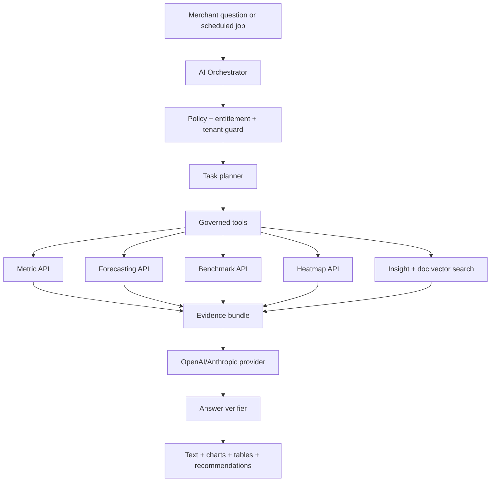

# AI Agent, Recommendation Engine, and RAG Architecture

## 1. AI design goals

The AI layer converts trusted business data into decisions. It should not hallucinate metrics, bypass authorization, or invent causal claims. LLMs synthesize narratives and interact conversationally, while deterministic analytical services calculate metrics, anomalies, forecasts, and recommendation scores.

## 2. AI architecture



## 3. Model responsibilities

| Capability | Deterministic models | LLM role |
| --- | --- | --- |
| Daily Business Brief | Metric deltas, anomaly detection, contribution analysis | Prioritize, narrate, and format executive brief |
| Root Cause Analysis | Decomposition, correlations, stockout checks, funnel deltas | Explain likely causes with caveats and evidence |
| Revenue forecasting | Time-series models, seasonality, channel features | Summarize forecast and operational implications |
| Inventory forecasting | Sales velocity, lead time, safety stock | Explain stockout risk and reorder action |
| Customer forecasting | Churn/LTV classifiers and cohort features | Translate segments into retention actions |
| Recommendations | Rules, uplift estimates, impact scoring | Generate human-readable reasoning and action plan |
| Chat | Governed tool execution and retrieval | Conversational synthesis and follow-up questions |

## 4. Daily Business Brief workflow

1. Scheduler runs per store at local morning time.
2. Metrics service computes yesterday, prior period, and trailing-window metrics.
3. Anomaly service detects statistically meaningful movements.
4. Root-cause service computes ranked drivers.
5. Forecast service adds revenue and inventory risk.
6. Benchmark service adds peer-context deltas where publishable.
7. Recommendation service proposes top actions.
8. LLM synthesizes the executive narrative from the evidence bundle.
9. Verifier checks that all numbers in the narrative exist in the bundle.
10. Brief is persisted as an `ai_insights` record and delivered in app/email.

## 5. Root-cause analysis design

### Inputs

- Target metric and date range.
- Comparison period.
- Store, channel, product, device, geography, and source dimensions.
- Inventory availability and stockout records.
- Ad metrics, GA4 events, email metrics, support tickets, heatmap events, page speed.

### Methods

- Metric decomposition: revenue = sessions × conversion rate × AOV.
- Product mix contribution analysis.
- Channel attribution shifts.
- Funnel step drop-off comparison.
- Stockout and availability joins.
- Paid media factor decomposition: spend, impressions, CPM, CTR, CPC, conversion rate, AOV, ROAS.
- Support/refund spike correlation.
- Heatmap friction signals for affected pages.
- Benchmark control: compare store movement against cohort movement.

### Output schema

```json
{
  "metric": "revenue",
  "change_percent": -18.0,
  "root_causes": [
    {
      "cause": "Best-selling SKU went out of stock",
      "contribution_percent": 42.0,
      "confidence_score": 0.87,
      "evidence": [
        { "metric": "variant_available_quantity", "value": 0 },
        { "metric": "lost_revenue_estimate_minor", "value": 350000 }
      ]
    }
  ]
}
```

## 6. Forecasting models

### Revenue forecasting

- MVP: Prophet-style additive seasonality or gradient boosted regression with lag features.
- Inputs: revenue, orders, sessions, spend, holidays, promotions, day of week, pay cycles, product launches.
- Outputs: 7-day, 30-day, 90-day forecasts with lower/upper bounds.

### Inventory forecasting

- Inputs: sales velocity, seasonality, current available inventory, incoming inventory, lead time, supplier minimum order quantity, campaign plan.
- Outputs: stockout date, reorder date, reorder quantity, revenue-at-risk.

### Customer forecasting

- Inputs: recency, frequency, monetary value, product categories, email engagement, support sentiment, refund history, discount usage.
- Outputs: churn probability, repeat purchase probability, predicted LTV, VIP likelihood.

## 7. Recommendation engine design

### Candidate generation

| Category | Candidate examples |
| --- | --- |
| Marketing | Increase budget on high-ROAS campaign, pause fatigued creative, move spend from high-CAC channel |
| Inventory | Reorder SKU, reduce promotion on constrained SKU, liquidate overstock |
| Pricing | Raise price on low-elasticity high-demand SKU, replace blanket discount with targeted offer |
| Product | Bundle products frequently bought together, feature winning product on homepage |
| Retention | Launch win-back segment, VIP early-access campaign, post-purchase flow optimization |
| UX | Move add-to-cart above fold, fix dead-click element, simplify checkout step |
| Benchmark | Improve metric where store is below peer p25 and impact is material |

### Scoring formula

```text
priority_score =
  0.35 * normalized_expected_revenue_impact
+ 0.20 * confidence_score
+ 0.15 * urgency_score
+ 0.10 * benchmark_gap_score
+ 0.10 * strategic_fit_score
- 0.05 * effort_score
- 0.05 * risk_score
```

### Required recommendation fields

- `category`
- `title`
- `summary`
- `reasoning`
- `evidence`
- `expected_revenue_impact_minor`
- `confidence_score`
- `effort_score`
- `risk_score`
- `success_metric`
- `expires_at`
- `owner_role`

### Impact estimation

Impact estimates should use conservative assumptions and state the method:

- Budget recommendation: marginal ROAS × budget delta × confidence discount.
- Inventory recommendation: forecasted demand during stockout window × margin.
- Pricing recommendation: expected unit change × price delta × elasticity confidence.
- UX recommendation: affected sessions × conversion uplift estimate × AOV × confidence discount.
- Retention recommendation: target segment size × expected response rate × predicted AOV.

## 8. AI chat architecture using RAG over business data

### Retrieval strategy

The chat assistant uses structured retrieval first and semantic retrieval second:

1. Classify intent: metric lookup, root cause, forecast, recommendation, benchmark, heatmap, how-to, or account question.
2. Resolve entities: date range, products, campaigns, channels, customer segment, geography, device.
3. Call governed metric tools for live data.
4. Retrieve relevant prior insights, recommendations, briefs, and connector metadata from vector search.
5. Retrieve benchmark aggregates if the plan and cohort allow it.
6. Assemble an evidence bundle.
7. Ask the LLM to answer only from the evidence bundle.
8. Verify numeric claims and attach data references.

### Tool catalog

| Tool | Purpose |
| --- | --- |
| `get_executive_metrics` | Revenue, profit, ROAS, CAC, AOV, conversion rate |
| `compare_metric_periods` | Deltas and decomposition between periods |
| `get_top_products` | Product ranking, profit, inventory risk |
| `get_campaign_performance` | Meta/Google performance metrics |
| `get_funnel_metrics` | Sessions, PDP views, add-to-cart, checkout, purchase |
| `get_heatmap_issues` | Rage clicks, dead clicks, scroll issues |
| `get_forecast` | Revenue, inventory, customer forecasts |
| `get_recommendations` | Current recommendations and statuses |
| `get_benchmark_comparison` | Anonymous peer percentile comparisons |

### Answer format

The assistant response should include:

- Direct answer.
- Key evidence table.
- Chart specification when useful.
- Recommendation cards.
- Confidence and caveats.
- Data freshness.
- Follow-up question suggestions.

## 9. AI safety and governance

- Do not expose data from other stores.
- Do not reveal benchmark cohort members.
- Do not generate unsupported numerical claims.
- Do not take irreversible actions without explicit user approval.
- Show uncertainty for forecasts and causal inference.
- Keep prompt templates versioned and evaluated.
- Store LLM token usage and cost by store and plan.

## 10. Evaluation

Automated evaluations:

- Numeric faithfulness: every number in answer matches evidence bundle.
- Tool selection accuracy by question class.
- Recommendation completeness.
- Causal explanation quality.
- Safety policy compliance.
- Latency and cost budgets.

Human evaluations:

- Merchant usefulness rating.
- Recommendation acceptance rate.
- Measured impact after execution.
