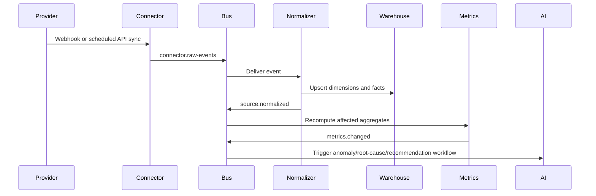

# Event-Driven Architecture

## 1. Event design goals

The event-driven layer decouples external integrations from normalization, analytics, AI insight generation, notifications, and benchmarking. Every external payload is captured as an immutable event, normalized into canonical entities, and then converted into facts, metrics, features, and recommendations.

## 2. Event envelope

```json
{
  "event_id": "evt_01J...",
  "event_type": "shopify.order.created",
  "event_version": 1,
  "organization_id": "org_...",
  "store_id": "store_...",
  "source": "shopify",
  "occurred_at": "2026-06-01T08:00:00Z",
  "received_at": "2026-06-01T08:00:03Z",
  "idempotency_key": "shopify:order:123:create:updated_at",
  "trace_id": "trace_...",
  "payload_ref": "s3://raw-events/.../event.json",
  "payload_hash": "sha256:..."
}
```

## 3. Core topics

| Topic | Producers | Consumers |
| --- | --- | --- |
| `connector.raw-events` | All connector services | Raw event archiver, normalization workers |
| `shopify.normalized` | Shopify normalization | Metrics, forecasts, recommendation service |
| `ads.normalized` | Ads normalization | Metrics, root-cause, benchmark service |
| `analytics.normalized` | GA4/website analytics | Funnel, heatmap, root-cause |
| `support.normalized` | Zendesk/Gorgias | Support insights, sentiment, root-cause |
| `email.normalized` | Klaviyo/Mailchimp | Retention analytics, attribution |
| `metrics.changed` | Metrics service | Insight generator, alerts, daily brief |
| `anomaly.detected` | Detection jobs | Root-cause service, notifications |
| `recommendation.created` | Recommendation service | Notifications, dashboard, experiment tracker |
| `brief.generated` | AI orchestrator | Email, in-app notification, Slack |
| `benchmark.aggregate.updated` | Benchmark service | Dashboard, AI orchestrator |

## 4. Processing pattern



## 5. Idempotency and replay

- Every event has an `idempotency_key` based on provider object ID, action, and version timestamp.
- Raw payloads are persisted to S3 before downstream processing.
- Normalizers are deterministic and can replay events from raw storage.
- Backfills emit the same normalized event types as webhooks.
- Materialized views can be rebuilt from canonical facts.

## 6. AI-triggered event flows

| Trigger | Conditions | Output |
| --- | --- | --- |
| Daily store brief | Store-local morning schedule | Executive summary insight record and notification |
| Revenue anomaly | Revenue z-score or Bayesian change point threshold | Root-cause analysis and recommendation candidates |
| Inventory risk | Forecasted stockout inside threshold | Restock recommendation |
| Campaign fatigue | CTR decline plus frequency increase plus creative age | Marketing recommendation |
| UX friction | Rage/dead-click or scroll-depth threshold | Heatmap insight and UX recommendation |
| Benchmark gap | Store percentile below threshold | Benchmark opportunity insight |

## 7. Event schema governance

- Event versions are append-only.
- Consumers must tolerate unknown fields.
- Breaking changes require new event types or versions.
- Schema registry stores JSON Schema for every event.
- PII classification is attached to fields at schema level.
