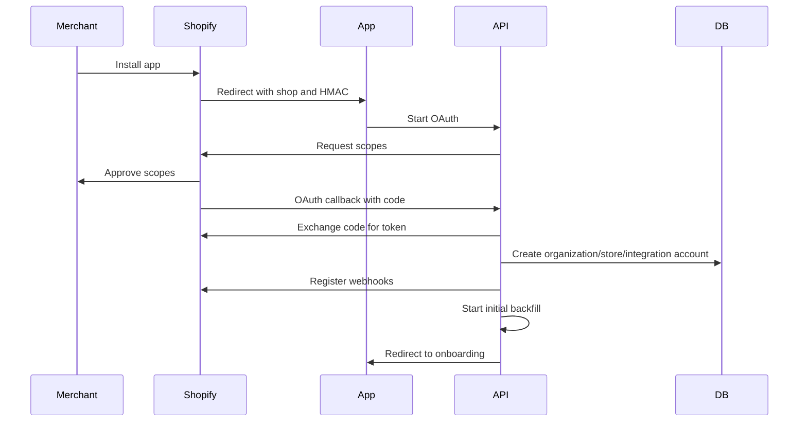

# Shopify App Architecture

## 1. App model

Commerce Intelligence AI is a Shopify embedded app with an external SaaS control plane. Shopify handles installation, merchant authorization, app billing for Shopify-native purchases, and webhook delivery. The SaaS platform handles multi-source data ingestion, analytics, AI, benchmarking, and multi-tenant access.

## 2. Shopify installation flow

## 3. Required Shopify scopes

MVP scopes:

- `read_orders`
- `read_products`
- `read_inventory`
- `read_customers`
- `read_discounts`
- `read_fulfillments`
- `read_returns`
- `read_analytics` when available for the app context

Potential future scopes after user approval:

- `write_discounts` for approved discount actions.
- `write_products` for approved merchandising changes.
- `write_inventory` only if merchants opt into operational automations.

## 4. Webhooks

| Webhook | Use |
| --- | --- |
| `orders/create` | Near-real-time revenue and order facts |
| `orders/updated` | Fulfillment, discount, and status changes |
| `orders/cancelled` | Revenue and inventory correction |
| `refunds/create` | Refund rate, margin, support root cause |
| `products/create` | Catalog dimension sync |
| `products/update` | Product/variant changes |
| `inventory_levels/update` | Stockout forecasting |
| `customers/create` | Customer dimension sync |
| `customers/update` | Customer lifecycle and segmentation |
| `app/uninstalled` | Token revocation and sync shutdown |
| `shop/update` | Store metadata refresh |

## 5. Backfill strategy

1. Create store and integration account.
2. Register webhooks before backfill to reduce missed changes.
3. Backfill historical orders, refunds, products, variants, inventory, customers, discounts, fulfillments, and returns.
4. Write cursor checkpoints by resource.
5. Reconcile webhook events that arrived during backfill.
6. Mark data freshness and expose onboarding completion status.

## 6. Shopify billing integration

Shopify app billing can be used for merchants installing through the Shopify App Store. Stripe can be used for direct SaaS/agency billing. Billing abstractions should support both.

Plan mapping:

- Free: no recurring application charge.
- Starter: $59 recurring application charge.
- Growth: $99 recurring application charge.
- Pro/Enterprise: custom contract via Stripe or manual Shopify billing agreement.

## 7. Embedded app UX

- Onboarding checklist: connect Shopify, choose timezone/currency, connect analytics, connect ads, connect email, opt into benchmarks.
- Admin frame compatible layout.
- Deep links to Shopify product, order, and customer records.
- Permission prompts should explain why each scope is needed.
- App must degrade gracefully when sources are not connected.

## 8. Data integrity

- Shopify IDs are stored as `provider_resource_id` strings.
- Monetary values are stored in minor units and normalized reporting currency.
- Order edits, refunds, cancellations, and returns must mutate net revenue facts.
- Product variants are first-class entities because inventory and sales often happen at variant level.
