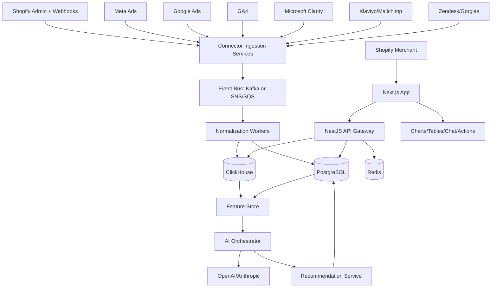

# Complete System Architecture

## 1. Architecture summary

Commerce Intelligence AI uses a modular multi-tenant SaaS architecture with a Next.js merchant application, NestJS API gateway, domain microservices, event-driven ingestion pipelines, PostgreSQL transactional storage, ClickHouse analytical storage, Redis queues/caches, and an AI orchestration layer.

## 2. Major components

### Frontend application

- Next.js App Router.
- TypeScript.
- Tailwind CSS.
- ShadCN UI components.
- TanStack Query for server state.
- Recharts or ECharts for charts.
- Server-side route protection for account, organization, store, role, and plan checks.

### Backend API

- NestJS API gateway exposes REST endpoints and optional GraphQL for dashboard composition.
- Domain modules: identity, billing, stores, connectors, metrics, insights, recommendations, chat, benchmarks, admin.
- Request context resolves tenant, store, user, role, plan, feature flags, and data freshness.

### Data layer

- PostgreSQL stores transactional SaaS state, normalized dimensions, recommendations, insights, users, roles, billing, and governance metadata.
- ClickHouse stores high-volume facts and events such as orders, sessions, page views, ad metrics, email events, support events, and benchmark aggregates.
- Redis stores short-lived cache, rate limits, distributed locks, idempotency keys, BullMQ queues, and chat stream state.

### AI layer

- Provider abstraction supports OpenAI and Anthropic.
- Tool-calling layer queries governed metric APIs rather than raw databases by default.
- Analytical models handle anomaly detection, attribution decomposition, forecasts, cohort features, churn scoring, and inventory projections.
- LLMs synthesize explanations, briefs, and recommendations from structured facts.

### Infrastructure

- Docker for local development.
- Kubernetes on AWS EKS for production.
- RDS PostgreSQL with row-level security support.
- ClickHouse Cloud or self-managed ClickHouse on Kubernetes.
- ElastiCache Redis.
- S3 for exports, generated reports, and raw ingestion snapshots.
- Secrets Manager for OAuth tokens and provider credentials.
- EventBridge/SNS/SQS for AWS-native deployment or Kafka for higher-throughput event streaming.

## 3. Microservice architecture

| Service | Responsibility | Primary data stores |
| --- | --- | --- |
| API Gateway | Authenticated API edge, request context, aggregation | PostgreSQL, ClickHouse, Redis |
| Identity Service | Users, organizations, roles, invites, JWT sessions | PostgreSQL, Redis |
| Billing Service | Plans, subscriptions, usage metering, entitlements | PostgreSQL, Stripe/Shopify Billing |
| Shopify Connector | OAuth, backfills, webhooks, Shopify API rate limiting | PostgreSQL, S3, event bus |
| Ads Connector | Meta and Google Ads syncs, campaign normalization | PostgreSQL, ClickHouse, event bus |
| Analytics Connector | GA4, website analytics, funnel events | ClickHouse, event bus |
| Heatmap Connector | Clarity session/heatmap metadata and UX events | ClickHouse, S3 |
| Email Connector | Klaviyo/Mailchimp campaigns, flows, subscriber metrics | ClickHouse, PostgreSQL |
| Support Connector | Zendesk/Gorgias tickets, tags, sentiment features | ClickHouse, PostgreSQL |
| Metrics Service | Semantic metric definitions and query APIs | ClickHouse, PostgreSQL |
| Forecasting Service | Revenue, inventory, customer forecasts | ClickHouse, Feature Store, PostgreSQL |
| Recommendation Service | Recommendation generation, scoring, lifecycle | PostgreSQL, ClickHouse |
| AI Orchestrator | LLM prompts, tools, summaries, chat/RAG | PostgreSQL, ClickHouse, vector index |
| Benchmark Service | Anonymous cohorts, percentile metrics, suppression rules | ClickHouse, PostgreSQL |
| Notification Service | Email, Slack, in-app alerts, daily brief delivery | PostgreSQL, queues |

## 4. Multi-tenant design

- Every tenant-owned table includes `organization_id` and/or `store_id`.
- All APIs derive store access from membership and role permissions.
- PostgreSQL row-level security is recommended for high-risk tables.
- ClickHouse queries must include store filters enforced by backend query builders.
- OAuth credentials are encrypted per integration account.
- Benchmarking uses cohort aggregates, not raw tenant joins exposed to the app.

## 5. Data freshness tiers

| Data class | Free | Starter | Growth | Pro/Enterprise |
| --- | --- | --- | --- | --- |
| Shopify orders | Daily | Daily | Every 4 hours | Hourly or webhook-near-real-time |
| Inventory | Daily | Daily | Every 4 hours | Hourly |
| Ads | Not included | Daily optional add-on | Every 4 hours | Hourly |
| GA4 | Not included | Daily | Every 4 hours | Hourly |
| Heatmap | Not included | Not included | Daily | Every 4 hours |
| Recommendations | Basic daily | Weekly | Daily | Daily plus on-demand |
| Benchmarks | Not included | Limited | Weekly | Daily/private cohorts |

## 6. Security architecture

- Shopify OAuth for installation and store authorization.
- JWT access tokens and rotating refresh tokens for app sessions.
- Fine-grained RBAC: owner, admin, analyst, marketer, inventory manager, read-only, agency admin.
- Encryption at rest through AWS KMS.
- Token encryption using envelope encryption.
- TLS everywhere.
- Audit logs for all sensitive actions.
- GDPR workflows for export, deletion, consent, and processor records.
- Webhook signature verification for Shopify and other providers.
- Rate limits by user, store, organization, and plan.

## 7. Observability

- OpenTelemetry traces across API, connectors, workers, and AI tools.
- Metrics: sync latency, webhook processing lag, LLM latency/cost, recommendation acceptance rate, data freshness, query latency.
- Logs with tenant-safe redaction.
- Alerts for failed connector syncs, high queue lag, anomalous spend, AI provider failures, and benchmark cohort suppression errors.

## 8. Failure modes and resilience

| Failure | Mitigation |
| --- | --- |
| Shopify API throttling | Adaptive rate limiter, cursor checkpoints, backoff, sync windows |
| Provider OAuth expiry | Token refresh monitoring, user re-auth prompts |
| AI provider outage | Provider fallback, cached insights, deterministic summaries |
| ClickHouse slow query | Pre-aggregations, materialized views, query timeouts |
| Duplicate webhooks | Idempotency keys and event versioning |
| Partial backfill | Checkpoints, replayable raw snapshots, reconciliation jobs |
