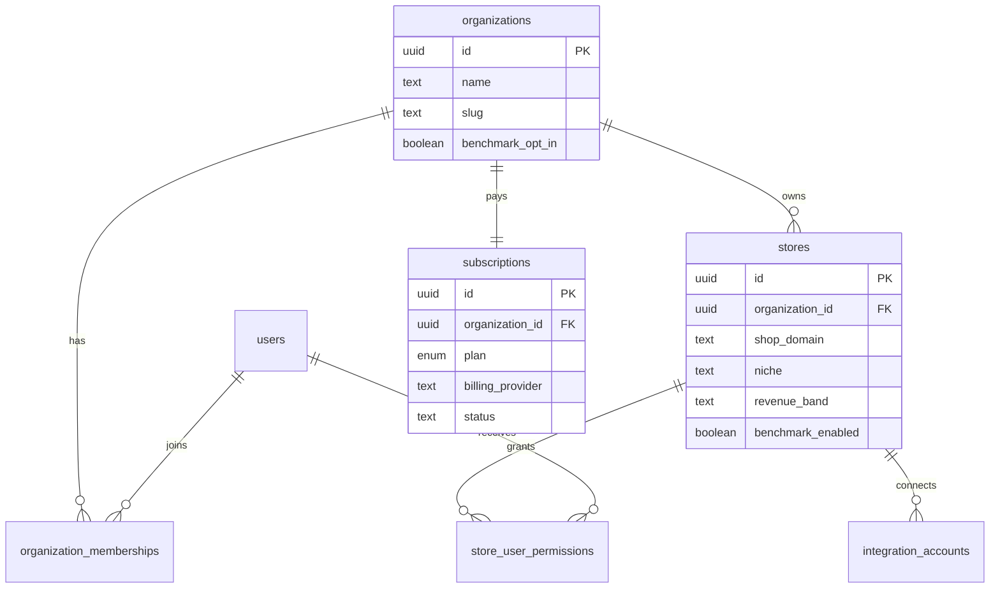
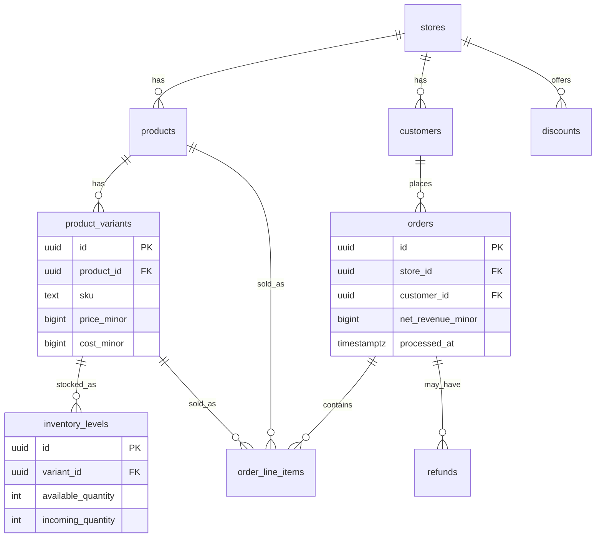
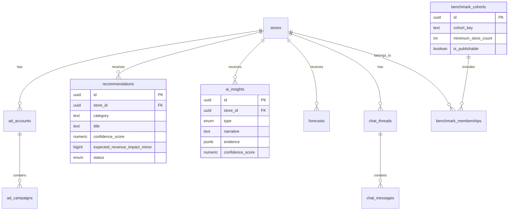

# ER Diagrams

## 1. SaaS tenancy and billing

```mermaid
erDiagram
  organizations ||--o{ organization_memberships : has
  users ||--o{ organization_memberships : joins
  organizations ||--o{ stores : owns
  organizations ||--|| subscriptions : pays
  stores ||--o{ store_user_permissions : grants
  users ||--o{ store_user_permissions : receives
  stores ||--o{ integration_accounts : connects

  organizations {
    uuid id PK
    text name
    text slug
    boolean benchmark_opt_in
  }
  subscriptions {
    uuid id PK
    uuid organization_id FK
    enum plan
    text billing_provider
    text status
  }
  stores {
    uuid id PK
    uuid organization_id FK
    text shop_domain
    text niche
    text revenue_band
    boolean benchmark_enabled
  }
```

## 2. Commerce entities

```mermaid
erDiagram
  stores ||--o{ products : has
  products ||--o{ product_variants : has
  product_variants ||--o{ inventory_levels : stocked_as
  stores ||--o{ customers : has
  customers ||--o{ orders : places
  orders ||--o{ order_line_items : contains
  products ||--o{ order_line_items : sold_as
  product_variants ||--o{ order_line_items : sold_as
  orders ||--o{ refunds : may_have
  stores ||--o{ discounts : offers

  orders {
    uuid id PK
    uuid store_id FK
    uuid customer_id FK
    bigint net_revenue_minor
    timestamptz processed_at
  }
  product_variants {
    uuid id PK
    uuid product_id FK
    text sku
    bigint price_minor
    bigint cost_minor
  }
  inventory_levels {
    uuid id PK
    uuid variant_id FK
    int available_quantity
    int incoming_quantity
  }
```

## 3. Marketing, AI, forecasting, and benchmarks

```mermaid
erDiagram
  stores ||--o{ ad_accounts : has
  ad_accounts ||--o{ ad_campaigns : contains
  stores ||--o{ recommendations : receives
  stores ||--o{ ai_insights : receives
  stores ||--o{ forecasts : receives
  stores ||--o{ chat_threads : has
  chat_threads ||--o{ chat_messages : contains
  stores ||--o{ benchmark_memberships : belongs_to
  benchmark_cohorts ||--o{ benchmark_memberships : includes

  recommendations {
    uuid id PK
    uuid store_id FK
    text category
    text title
    numeric confidence_score
    bigint expected_revenue_impact_minor
    enum status
  }
  ai_insights {
    uuid id PK
    uuid store_id FK
    enum type
    text narrative
    jsonb evidence
    numeric confidence_score
  }
  benchmark_cohorts {
    uuid id PK
    text cohort_key
    int minimum_store_count
    boolean is_publishable
  }
```
