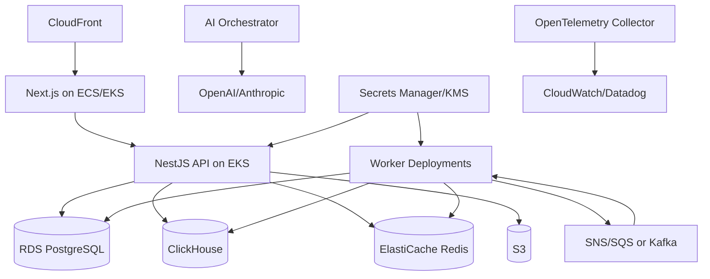

# Production Plan: Scaling, Security, Infrastructure, Revenue Model, and Implementation

## 1. Infrastructure architecture

## 2. Kubernetes deployment units

- `web`: Next.js app.
- `api`: NestJS API gateway.
- `worker-shopify`: Shopify backfills and webhooks.
- `worker-ads`: Meta/Google Ads syncs.
- `worker-analytics`: GA4, website, heatmap syncs.
- `worker-ai`: Daily briefs, chat tools, recommendations.
- `worker-forecasting`: Forecast and feature jobs.
- `worker-benchmark`: Cohort aggregation and suppression.
- `scheduler`: CronJobs for recurring syncs.

## 3. Scaling strategy

### Application scaling

- Horizontally scale API pods by CPU, request rate, and p95 latency.
- Horizontally scale workers by queue depth and oldest job age.
- Separate connector workers to isolate provider throttling.
- Use Redis distributed locks for per-store sync exclusivity.

### Database scaling

- PostgreSQL read replicas for read-heavy admin and app queries.
- Partition high-volume PostgreSQL audit and sync tables by month if needed.
- ClickHouse partition by month and order by store/date/entity.
- Materialized views for executive and daily metrics.
- Pre-aggregate dashboard queries and benchmark metrics.

### AI cost scaling

- Use deterministic metrics and compact evidence bundles before LLM calls.
- Cache stable insights and benchmark summaries.
- Route simple metric questions to smaller/cheaper models.
- Apply plan-based AI question limits.
- Track cost per store, per feature, per model.

## 4. Security controls

| Area | Control |
| --- | --- |
| Authentication | Shopify OAuth, JWT access tokens, rotating refresh tokens |
| Authorization | Organization/store RBAC and entitlement middleware |
| Secrets | AWS Secrets Manager, KMS envelope encryption |
| Webhooks | HMAC signature verification and replay protection |
| Data isolation | Tenant-scoped APIs, row-level security for sensitive tables |
| PII | Hash or encrypt customer identifiers; redact logs |
| Auditability | Audit logs for auth, billing, exports, connector changes, recommendations |
| Network | Private subnets for databases, restricted security groups |
| Compliance | GDPR export/delete workflows and subprocessors register |
| AI safety | Evidence-bound answers, no raw cross-tenant data, benchmark suppression |

## 5. GDPR compliance

- Data processing agreement and subprocessors list.
- Data export endpoint for merchant-owned data.
- Customer erasure workflow keyed by Shopify customer ID/email hash.
- Store uninstall workflow to stop sync and schedule deletion/retention policy.
- Consent-aware benchmark opt-in.
- PII minimization in ClickHouse facts.

## 6. Revenue model

| Plan | Price | Primary value | Expansion levers |
| --- | ---: | --- | --- |
| Free | $0/month | Basic Shopify visibility and limited AI | Upgrade prompts for history, connectors, and AI limits |
| Starter | $59/month | Decision support for small stores | Add ads, forecasting, heatmaps, benchmarks |
| Growth | $99/month | Full growth intelligence for scaling stores | Extra stores, higher AI limits, faster sync |
| Pro | Custom | Agencies and advanced operators | API, multi-store portfolio, advanced roles |
| Enterprise | Custom | Brands with governance and custom needs | SSO, private benchmarks, data residency, SLA |

Usage-based add-ons:

- Extra AI questions.
- Extra stores.
- Hourly sync upgrade.
- Advanced benchmark cohorts.
- Agency client portfolio.
- Custom connector.

## 7. Technical implementation plan

### Backend

1. Create NestJS modules for identity, stores, billing, connectors, metrics, insights, recommendations, forecasts, chat, benchmarks.
2. Implement request context middleware.
3. Add RBAC and entitlement guards.
4. Implement Shopify OAuth, billing, and webhooks.
5. Build metric query service backed by ClickHouse.
6. Build recommendation lifecycle APIs.
7. Add OpenAPI generation and contract tests.

### Frontend

1. Create embedded app shell and onboarding checklist.
2. Build global dashboard layout with date range and store switcher.
3. Implement Executive Dashboard cards and brief panel.
4. Build Product, Marketing, Customer, Funnel, Heatmap, Forecasting, Benchmark pages.
5. Implement AI Chat with streaming responses and evidence drawers.
6. Add plan-gated upsell states.

### Data and AI

1. Implement raw event archive.
2. Build connector sync jobs and normalizers.
3. Define semantic metric layer.
4. Add anomaly detection and contribution analysis.
5. Implement forecast model services.
6. Implement recommendation candidate generation and scoring.
7. Implement AI orchestrator, tool registry, provider abstraction, numeric verifier.
8. Add benchmark aggregation with suppression thresholds.

## 8. SLOs

| Capability | SLO |
| --- | --- |
| API availability | 99.9% for paid plans |
| Dashboard p95 latency | < 1.5 seconds for cached metrics |
| Chat first token | < 4 seconds for typical analytical question |
| Shopify webhook processing | p95 < 60 seconds |
| Daily brief delivery | By 8:00 AM store-local time |
| Sync freshness | Within plan-specific freshness window |

## 9. Operational runbooks

- Connector degraded: pause affected sync jobs, show data freshness warning, retry with backoff.
- AI provider outage: switch provider, fall back to cached/deterministic insights.
- ClickHouse overload: disable expensive ad hoc queries, use pre-aggregates.
- Benchmark suppression issue: stop publishing cohort, recalculate aggregates, audit output.
- Token refresh failures: mark connector `reauth_required` and notify store owner.
