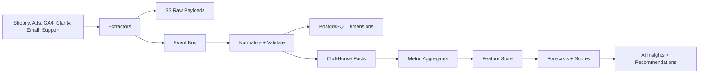

# Data Pipelines

## 1. Pipeline overview

Commerce Intelligence AI uses ELT-style ingestion with raw payload capture, canonical normalization, analytical fact generation, feature generation, and AI insight production.

## 2. Connector patterns

| Connector | Mode | Notes |
| --- | --- | --- |
| Shopify | OAuth, webhook, scheduled backfill | Register webhooks before initial backfill; reconcile edits/refunds |
| Meta Ads | OAuth, scheduled API sync | Daily and intraday insights; normalize campaign/adset/ad hierarchy |
| Google Ads | OAuth, scheduled API sync | Pull campaigns, PMax, shopping, search terms, conversions |
| GA4 | OAuth/service account, scheduled sync | Funnel and journey metrics by source/device/geography |
| Microsoft Clarity | API/export where available | Heatmap metadata, rage/dead click events, recording links |
| Website analytics | Pixel or server events | Core Web Vitals, product page performance, custom funnel events |
| Klaviyo/Mailchimp | OAuth/API key, scheduled sync | Campaign/flow metrics, subscriber growth, revenue attribution |
| Zendesk/Gorgias | OAuth/API key, webhook/sync | Tickets, tags, categories, refund requests, sentiment |

## 3. Shopify ingestion pipeline

1. OAuth installation creates store and encrypted token.
2. Webhooks are registered.
3. Initial backfill begins by resource type.
4. Raw API pages are stored in S3.
5. Normalizer upserts products, variants, inventory, customers, orders, line items, refunds, discounts.
6. Analytical facts are written to ClickHouse.
7. Data freshness status is updated.
8. Metrics and AI jobs are triggered for affected periods.

## 4. Paid media pipeline

1. Sync account and campaign hierarchies into PostgreSQL.
2. Pull daily or intraday performance metrics.
3. Normalize spend into store reporting currency.
4. Write `fact_ad_metrics_daily`.
5. Join with GA4 and Shopify revenue where attribution is available.
6. Detect creative fatigue, ROAS shifts, CAC changes, and budget allocation opportunities.

## 5. Funnel and website analytics pipeline

1. Ingest GA4 sessions/events and website pixel events.
2. Normalize canonical funnel steps: session, product_view, add_to_cart, begin_checkout, purchase.
3. Store high-volume events in ClickHouse.
4. Generate funnel aggregates by date/source/device/page/product.
5. Detect drop-off changes and conversion bottlenecks.

## 6. Heatmap intelligence pipeline

1. Pull Clarity project/session metadata and heatmap event aggregates.
2. Normalize rage clicks, dead clicks, scroll depth, page URL, device, and severity.
3. Link page URLs to product and collection entities when possible.
4. Compute UX issue scores.
5. Attach affected revenue and sessions.
6. Generate UX recommendations.

## 7. Forecast feature pipeline

| Feature family | Examples |
| --- | --- |
| Sales lags | Revenue/orders by 1, 7, 14, 28 day lags |
| Seasonality | Day of week, month, holiday, pay cycle |
| Marketing | Spend, impressions, clicks, ROAS, campaign launches |
| Product | Inventory availability, price, discount, product age |
| Customer | New vs returning mix, cohort repeat rate, churn indicators |
| UX | Page speed, funnel drop-off, heatmap friction |
| Support | Complaint volume, refund request rate, sentiment |
| Benchmark | Cohort median movement and percentile gap |

## 8. Data quality checks

- Uniqueness by provider IDs.
- Non-negative monetary values after normalization except explicit adjustments.
- Currency conversion coverage.
- Missing customer/order links.
- Webhook signature validation.
- Backfill completeness by cursor windows.
- Revenue reconciliation between Shopify and ClickHouse facts.
- Ad spend reconciliation by provider account.
- Suppression checks for benchmark cohorts.

## 9. Data retention

| Data type | Free | Paid | Enterprise |
| --- | --- | --- | --- |
| Raw payloads | 7 days | 30 days | Configurable |
| Analytical facts | 7 days visible | Plan-based history | Contractual |
| Chat messages | 30 days | 12 months | Configurable |
| AI insights | 30 days | 24 months | Configurable |
| Benchmark aggregates | Aggregated only | Aggregated only | Private cohort option |
